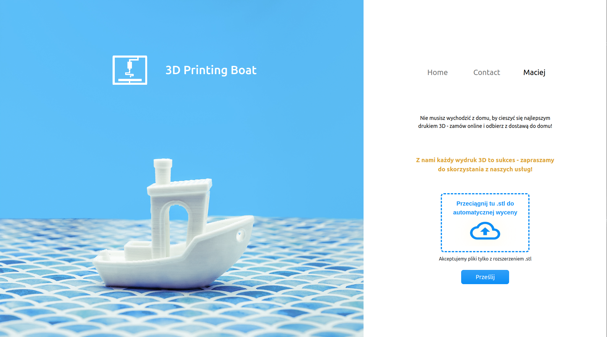
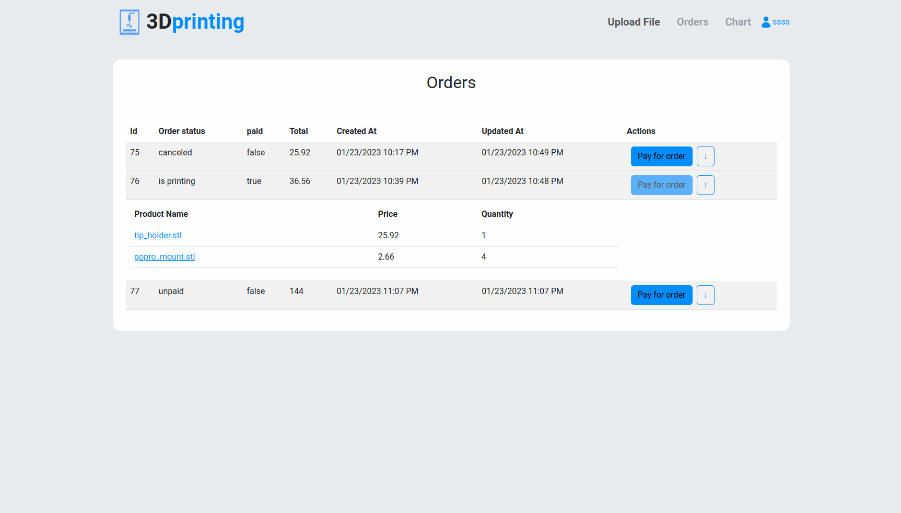
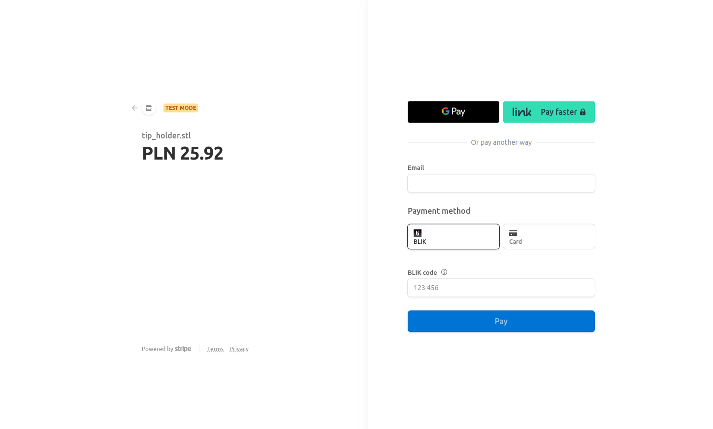
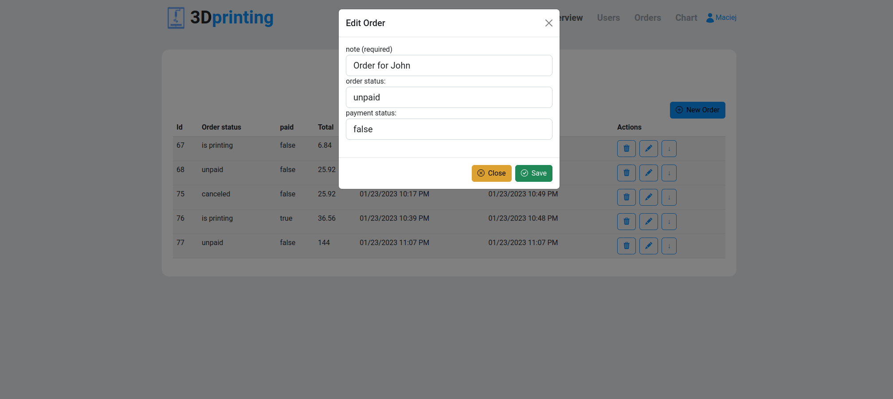
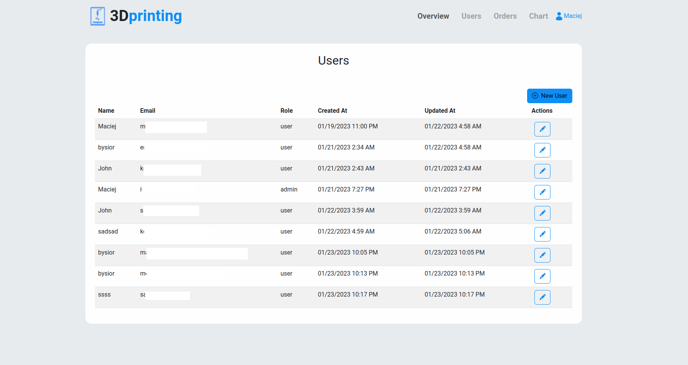
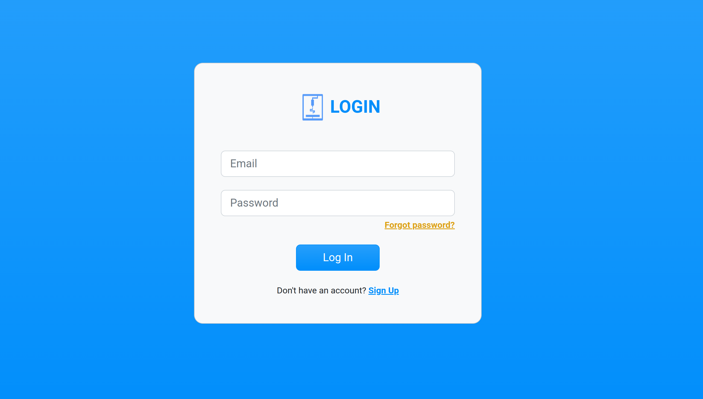
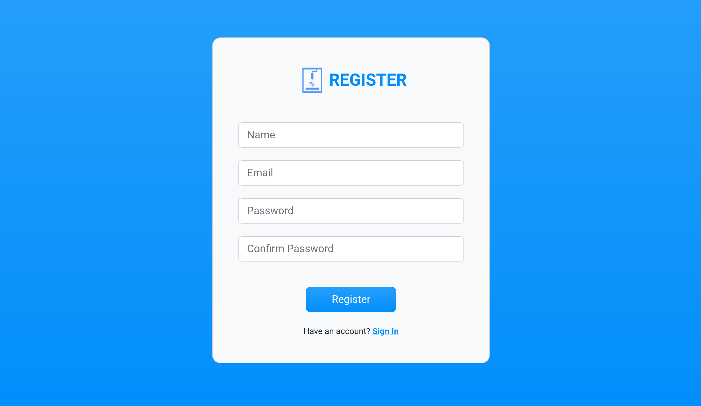
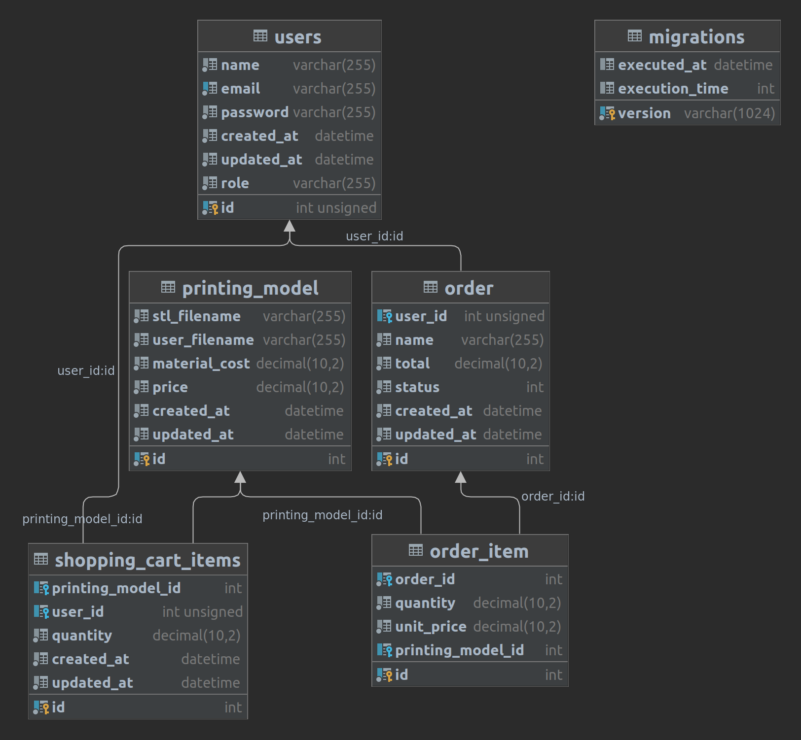

# 3d printing shop app
This is simple educentional project of php web application.
Handle .stl files from user, could aproximate price of printing, allow user to add .stl models to  and send email .

The app uses docker containers to run php, mysql, mailhog and nginx.
PHP use:
- **Slim framework** and **Twig** template engine.
- **Doctrine ORM** to communicate with database.
- **PHP-DI** to handle dependency injection.
- **Stipe API** to handle payments.
- **PHPMailer** to send emails.
- **Symfony console** to run commands.
- **PHPunit** to run tests.
- **Composer** to manage dependencies.
- **NPM** to manage frontend dependencies.
- **Webpack** to compile frontend assets.
- **environment variables** are stored in .env file.

## App preview
Index

User Orders panel

User checkout Stripe page

Admin edit order

Admin User Panel

Login Page

Register Page



## App features
* User can register and login
* User can upload .stl file
* User can see list of uploaded files
* Admin can see list of all orders
* Admin can see details of order
* Admin can change order status
* App send email to user after order is updated
* Order can be paid with stripe
* user password is hashed with bcrypt
* implement drag and drop file upload
* csrf protection for forms
* sql injection protection


## TO DO
* Add more tests
* password recovery 
* improve security
* each user have access to every file - it should be changed
* add more features to admin panel
* add admin dashboard
* add filaments to database
* allow user to choose filament
* allow user to specify quality of print
* allow to track filament in stock
* chart submit empty orders, it should be repaired
* add .stl live preview using JS
* render thumbnail of .stl file
* add support for more file formats
* cost of print should be calculated based on slicer data not only volume
* add privacy policy page
* add terms of use page
* improve email templates
* find order by order number in admin panel
* find order by user email in admin panel
* filtr orders by status in admin panel
* add shipping functionality (now is only pickup)
* add webhooks to stripe to handle payments in real time and when user drop his connection
* allow blocked user to access his account and show him message why he is blocked and basic informations

## Database diagram

# 3d printing shop app
This is simple educentional project of php web application.
Handle .stl files from user, could aproximate price of printing, allow user to add .stl models to  and send email .

The app uses docker containers to run php, mysql, mailhog and nginx.
PHP use:
- **Slim framework** and **Twig** template engine.
- **Doctrine ORM** to communicate with database.
- **PHP-DI** to handle dependency injection.
- **Stipe API** to handle payments.
- **PHPMailer** to send emails.
- **Symfony console** to run commands.
- **PHPunit** to run tests.
- **Composer** to manage dependencies.
- **NPM** to manage frontend dependencies.
- **Webpack** to compile frontend assets.
- **environment variables** are stored in .env file.

## App preview
Index

User Orders panel

User checkout Stripe page

Admin edit order

Admin User Panel


## App features
* User can register and login
* User can upload .stl file
* User can see list of uploaded files
* Admin can see list of all orders
* Admin can see details of order
* Admin can change order status
* App send email to user after order is updated
* Order can be paid with stripe
* user password is hashed with bcrypt
* implement drag and drop file upload
* csrf protection for forms
* sql injection protection


## TO DO
* Add more tests
* password recovery 
* improve security
* each user have access to every file - it should be changed
* add more features to admin panel
* add admin dashboard
* add filaments to database
* allow user to choose filament
* allow user to specify quality of print
* allow to track filament in stock
* chart submit empty orders, it should be repaired
* add .stl live preview using JS
* render thumbnail of .stl file
* add support for more file formats
* cost of print should be calculated based on slicer data not only volume
* add privacy policy page
* add terms of use page
* improve email templates
* find order by order number in admin panel
* find order by user email in admin panel
* filtr orders by status in admin panel
* add shipping functionality (now is only pickup)

## Database diagram

## IDE setup
### To set up step debugger in phpStorm you have to config path mapping in IDE
1. Go to Settings > Languages & Frameworks > PHP and create a server with a hostname localhost
2. Check use path mappings
3. Add mapping like: C:\pathOnYourDisk\mySite mapped to remote /var/www/mySite
   * To generate own files map run this command
   ```composer dump-autoload -o```
## Links
* main page ```http://localhost:8000/```
* local email inbox:
```http://localhost:8025/```

  
## Docker
* To enter docker container command line
```docker exec -it 3d-printing-app /bin/bash```
* To reload nginx.conf without restarting
```docker exec 3d-printing-nginx nginx -s reload```
* To run docker-compose from terminal
```docker-compose up -d --build```
* To force rebuild whole container
```docker-compose build --no-cache --pull```
* To exec command driectly on docker maching
```docker exec -ti 3d-printing-app sh -c "echo hello world"```

## Before start
*  ```composer install``` & ```npm install```
* ```npm run dev```
* ```docker-compose up -d --build```
## App CLI 
run commands in 3d-printing-app docker commandline
### About database migration
* To generate database schema: ```php myapp migrations:diff```
* To create schema on database: ```php myapp migrations:migrate```

### List all available command
* ```php myapp list```


### To run tests
```./vendor/bin/phpunit```

## Credits
 * Software used to create database diagram
 https://drawsql.app/
 * Logo design https://pixabay.com/pl/users/krzysztof-m-1363864/
 * Preview illustraton from: https://pixabay.com/pl/illustrations/%d0%bb%d0%be%d1%83%d0%bf%d0%be%d0%bb%d0%b8-3d-blender-poligon-drzewo-3494476/
